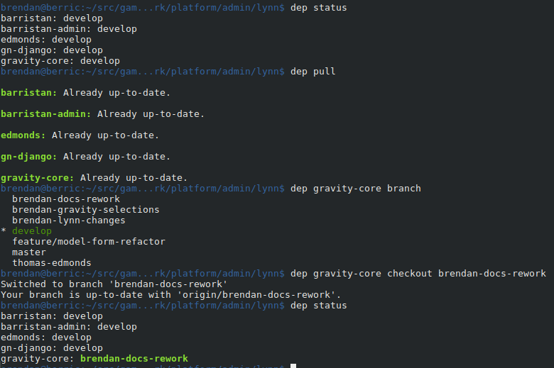

dep
===

``dep`` is a simple tool to make managing local development dependencies easier.
It assumes that your dependencies are git repositories under ``./lib/`` and 
offers a simple status command, pull and proxied git commands as follows:

Installation
------------

On linux... clone the repo and run ``./install.sh``.
